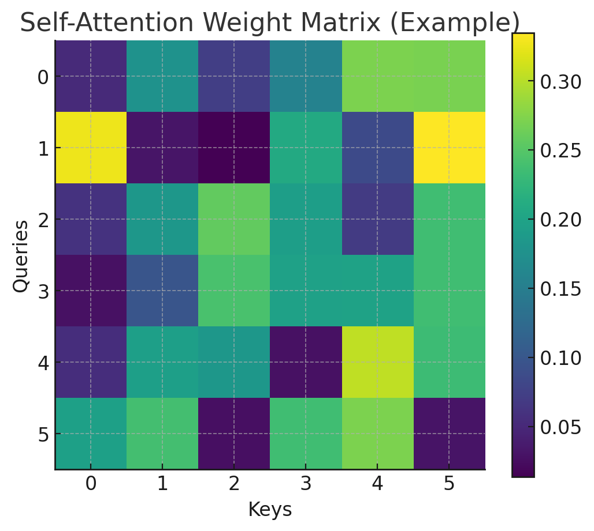
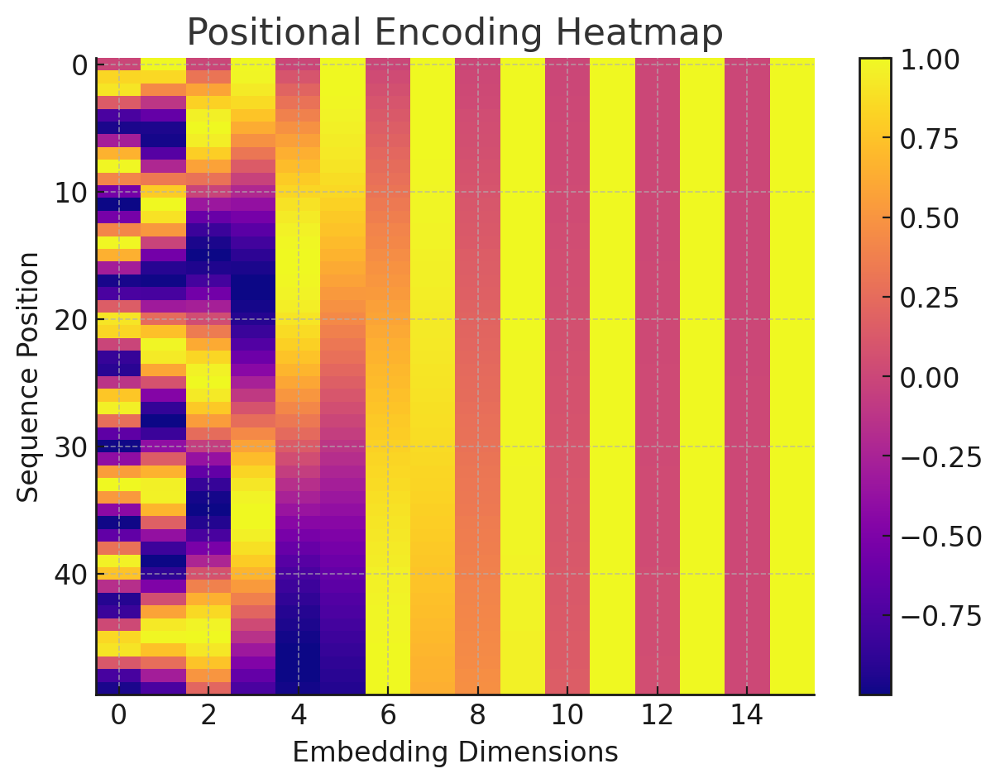

# Task 2: Transformer Networks and Cybersecurity

## Transformer Network Description

The Transformer is a neural network architecture introduced in 2017 that revolutionized sequence modeling by removing the need for recurrent or convolutional operations. Instead, it relies entirely on attention mechanisms, allowing the model to evaluate relationships between all tokens in a sequence simultaneously. This parallelism dramatically improves training efficiency and enables the model to capture long-range dependencies more effectively than RNNs or LSTMs.

A Transformer is composed of encoder and decoder stacks. Each encoder layer includes multi-head self-attention, feed-forward networks, residual connections, and normalization. The decoder expands on this with masked self-attention and encoder–decoder attention. Multi-head attention allows the model to learn multiple representation spaces at once, improving its ability to understand complex patterns. Positional encoding compensates for the absence of recurrence by injecting information about token order.

### Applications in Cybersecurity

Transformers have become fundamental in cybersecurity due to their ability to analyze high-dimensional, sequential, and unstructured data. Key applications include:

- **Intrusion Detection:** Transformers analyze long network traffic sequences, detecting anomalies such as DDoS patterns, lateral movement, or malware beaconing.
- **Log Analysis:** Models like BERT classify log entries, detect insider threats, recognize abnormal sequences, and extract semantic meaning from system events.
- **Malware Analysis:** Transformers identify malicious code fragments, API-call behavior, and opcode sequences using attention to focus on critical patterns.
- **Threat Intelligence Automation:** Large language models extract IOCs, summarize reports, and generate defensive signatures.
- **Phishing and Fraud Detection:** Text-based models analyze email content, URLs, and metadata to identify malicious intent.
- **Secure Code Review:** Transformers detect vulnerabilities in source code and suggest fixes.

Transformers’ contextual reasoning, scalability, and ability to integrate text, logs, and binary patterns make them essential tools in modern AI-driven cybersecurity operations.

---

## Attention Mechanism Visualization

The matrix below represents how each **query** token attends to each **key** token. Lighter colors indicate stronger attention weights.

---

## Positional Encoding Visualization

This heatmap shows sinusoidal positional encoding across 50 time steps and 16 embedding dimensions.

